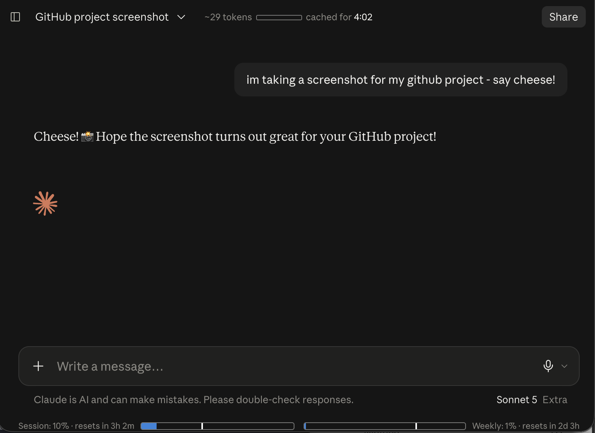
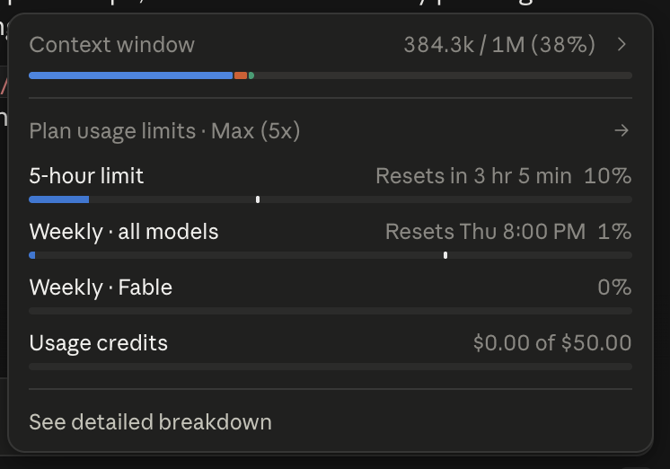

# Claude Counter

> **Fork.** Of [she-llac/claude-counter](https://github.com/she-llac/claude-counter),
> which has been dormant since 2026-03-21 with the claude.ai redesign fixes sitting
> unmerged. This fork carries the fix for the layout the **Chat/Cowork** switch broke:
> usage bars no longer render on top of the composer controls, and the token counter
> attaches again. See [MAINTAINING.md](./MAINTAINING.md).

A minimal browser extension that shows token count, cache timer, and usage bars on claude.ai.



*In a conversation — approximate token count with a mini bar against the context
limit, the cache countdown, and session/weekly usage bars sitting below the composer
rather than on top of its controls, which is what the Chat/Cowork redesign broke.*



*On `claude.ai/code` — a marker added to Claude Code's own usage bars showing how far
through the reset window you are. Here the 5-hour limit is 10% used but 38% through
its window, so usage is well under pace.*

## Features

- **Token count** — Approximate token count for the current conversation, with a mini progress bar against the 200k context limit
- **Cache timer** — Countdown showing how long the conversation remains cached (cheaper to continue)
- **Usage bars** — Session (5-hour) and weekly (7-day) usage from Claude's native API, with progress bars and reset countdowns (more accurate than the rounded /usage page)

### Claude Code (`claude.ai/code`)

Claude Code's own usage popover — the circular indicator in the corner — already
shows each limit's percentage, reset time and a fill bar. What it does not show is
**how far through the reset window you are**, which is what tells you whether your
usage is ahead of or behind pace.

This fork adds that: a marker on each limit bar at the window position, with a
tooltip like `6% through the window, 4h 43m left — ahead of pace`. Rows without a
reset window (Usage credits, Context window) are left untouched.

Addresses upstream issue [#13](https://github.com/she-llac/claude-counter/issues/13).

## Installation

Grab the `.zip` (Chrome) or `.xpi` (Firefox) from the
**[latest release](../../releases/latest)**. The links below point at the release
page rather than at a file name on purpose — an asset whose name does not match the
link exactly gives a 404, and the name is easy to change by accident on upload.

**Chrome / Edge / Chromium**

1. Download the `.zip` from the [latest release](../../releases/latest)
2. Go to `chrome://extensions` and enable **Developer mode**
3. Drag and drop the zip onto the page

**Firefox**

1. Download the `.xpi` from the [latest release](../../releases/latest)
2. It is unsigned, so release Firefox will refuse a normal install. Use
   `about:debugging` → *Load Temporary Add-on*, or Developer Edition with
   `xpinstall.signatures.required=false`

**Userscript**

1. Install the userscript from [`claude-counter.user.js`](./userscript/claude-counter.user.js)

**From source** — no release needed:

```bash
git clone https://github.com/joker47man/claude-counter-fork.git
cd claude-counter-fork && bash tools/build.sh     # writes dist/
```

Or load `chrome://extensions` → *Load unpacked* and point it at the clone.

## How it works

- Intercepts Claude's API responses to read conversation data and usage info
- Uses a vendored tokenizer (`o200k_base`) for approximate token counting
- Uses Claude’s `/usage` plus live SSE `message_limit` data; the SSE provides exact, unrounded utilization fractions, so the progress bars are more accurate than the rounded percentages shown on Claude’s native /usage page
- Watches for DOM changes to inject UI elements as you navigate

## Privacy

- All data stays local — no external servers, no tracking
- Reads your `lastActiveOrg` cookie to query Claude's `/usage` endpoint
- Makes requests only to `claude.ai`

## Credits

- Redesign layout fix from upstream PR [#46](https://github.com/she-llac/claude-counter/pull/46) by [@ashishahir1](https://github.com/ashishahir1)

- Token counting via [gpt-tokenizer](https://github.com/niieani/gpt-tokenizer) (MIT)
- Inspired by [Claude Usage Tracker](https://github.com/lugia19/Claude-Usage-Extension) by lugia19

## License

MIT
